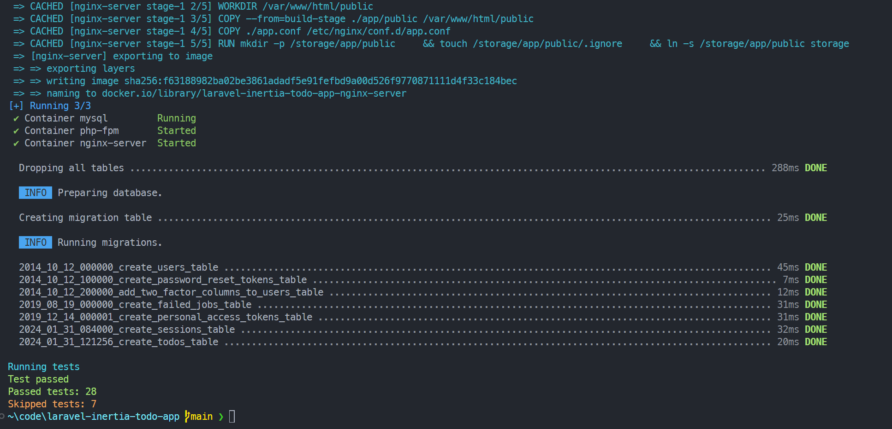

# Laravel + Vite + Vue Dockerizing
- Creating a docker file for each service
 - ### For this application we have a 3 services 
 1. PHP service - to run our application 
 2. nginx service - reverse proxy with vite and vue build files
 3. mysql service - for db setup and data storing (This can be setup seperately in a production environment so it can be clustered seperately)
### Workflow Idea
The current idea for the workflow is that after the environment is setup, the deployment team can do a test on the server or after the creation of the containers.
#### If the Environment is setup correctly 
##### Windows
run on powershell
```bash
./build.ps1
```

##### Linux
run
```bash
bash build.sh
```

Test outputs from these commandes will be at 
[Test Output](./testoutput.txt)
***___we are running it with bash to standardize output of the command___***

### Docker Compose File
```yaml
version: "3"
services:
    mysql:
        image: mariadb:10.6
        container_name: mysql
        restart: unless-stopped
        tty: true
        ports:
            - 3307:3306
        environment:
            MYSQL_DATABASE: ${DB_DATABASE}
            MYSQL_USER: ${DB_USERNAME}
            MYSQL_PASSWORD: ${DB_PASSWORD}
            MYSQL_ROOT_PASSWORD: ${DB_PASSWORD}
            SERVICE_TAGS: dev
            SERVICE_NAME: mysql
        volumes:
            - todo-mysql-data:/var/lib/mysql
        networks:
            - default
    php-fpm:
        build:
            context: .
            dockerfile: /docker/php/DOCKERFILE
        depends_on:
            - mysql
        container_name: php-fpm
        restart: unless-stopped
        user: www-data #Use www-data user for production usage
        volumes:
            #Project root
            - ./:/var/www/html
        networks:
            - default #if you're using networks between containers
    #Nginx server
    nginx-server:
        build:
            context: .
            dockerfile: /docker/nginx/DOCKERFILE
        depends_on:
            - php-fpm
        container_name: nginx-server
        restart: unless-stopped
        ports:
            - 9669:80
        volumes:
            #Project root
            - ./:/var/www/html
        environment:
            - DOCUMENT_ROOT=/var/www/html/public
            - CLIENT_MAX_BODY_SIZE=20M
            - PHP_FPM_HOST=php-fpm:9000
        networks:
            - default
volumes:
  todo-mysql-data:
    external: false
```

### Services
#### PHP
- since we needed to create an image to run our application we used this service in the compose file is linked to a dockerfile
```dockerfile
  FROM php:8.3-fpm
  COPY ./ ./
    # removing the vendor folder
    RUN rm -rf vendor

    # updating the packages in the image, and cleaning the obsolete packages 
    RUN apt-get update -y && apt-get upgrade -y && apt-get autoremove -y && apt-get autoclean -y

    # Installing php extensions using php-extension installer
    COPY --from=mlocati/php-extension-installer /usr/bin/install-php-extensions /usr/local/bin/
    RUN install-php-extensions @composer-2.2.4
    # Here we specify what extensions are needed for this application to run
    RUN install-php-extensions pdo_mysql sockets zip


    # Create folders required by Laravel and giving permission to the created folder
    RUN mkdir -p bootstrap/cache storage/app storage/framework/cache storage/framework/sessions storage/framework/views \
    storage/logs secrets \
    && chown -R www-data /var/www /var/www/html \
    && composer install --ignore-platform-reqs \
    && php artisan storage:link \
    && rm -rf docker

    USER www-data
    VOLUME /var/www/html/storage
    WORKDIR /var/www/html

    EXPOSE 9000

```
- in this dockerfile we are preparing and creating an image to run the source code. As a base image this is using the php-fpm with php version 8.3
  
#### Nginx Server

```dockerfile
FROM node:18.16.0 as build-stage

WORKDIR /app

# preparing the vite app for production
COPY . .
RUN npm install
RUN npm run build


FROM nginx:alpine


WORKDIR /var/www/html/public
# copying the built app to the nginx server
COPY --from=build-stage ./app/public /var/www/html/public

# copying the nginx configuration file
COPY ./docker/nginx/app.conf /etc/nginx/conf.d/app.conf
#creating the storage folder and linking it to the public folder
RUN mkdir -p /storage/app/public \
    && touch /storage/app/public/.ignore \
    && ln -s /storage/app/public storage

EXPOSE 80


```

- here there is a two part build process
  - firstly we are creating the vite production assets with a base image from node js
  - then we are assigning that created image a name ***build-stage***
- When we are creating the nginx server we are copying the build file from that app to the folder on the nginx server
##### Nginx conifiguration
```nginx
server {
    listen       80;
    server_name  localhost;
    root         /var/www/html/public;

    access_log /var/log/nginx/access.log;
    error_log  /var/log/nginx/error.log;
    index index.php;

    ## PHP server routing
    location ~ \.php$ {
    fastcgi_split_path_info ^(.+\.php)(/.+)$;
    fastcgi_pass php-fpm:9000;
    fastcgi_index index.php;
    include fastcgi.conf;
    }
    ## Entry point to the vite application
    location / {
    try_files $uri $uri/ /index.php?$query_string;
    }
}
```
This is the configuration for the nginx server to distribute traffic from this server

## Scripts

### docker-setup

This script is removing existing docker installations and cleaning it before adding the docker official keys and re-installing the docker apps. 
This is a standalone docker server but in recommendations i will highlight how we can create a swarm and set it up to run the services. 
```bash
sudo apt-get remove docker docker-engine docker.io containerd runc
sudo apt-get purge docker-ce docker-ce-cli containerd.io docker-compose-plugin docker-compose
sudo rm -rf /etc/bash_completion.d/docker /usr/local/bin/docker-compose /etc/bash_completion.d/docker-compose
sudo apt autoremove -y && sudo apt autoclean -y


# Add Docker's official GPG key:
sudo apt-get update
sudo apt-get install ca-certificates curl
sudo install -m 0755 -d /etc/apt/keyrings
sudo curl -fsSL https://download.docker.com/linux/ubuntu/gpg -o /etc/apt/keyrings/docker.asc
sudo chmod a+r /etc/apt/keyrings/docker.asc

# Add the repository to Apt sources:
echo \
  "deb [arch=$(dpkg --print-architecture) signed-by=/etc/apt/keyrings/docker.asc] https://download.docker.com/linux/ubuntu \
  $(. /etc/os-release && echo "$VERSION_CODENAME") stable" | \
  sudo tee /etc/apt/sources.list.d/docker.list > /dev/null
sudo apt-get update
sudo apt-get install docker-ce docker-ce-cli containerd.io docker-buildx-plugin docker-compose-plugin
```

### Build, bash and powershell script
Since i worked on powershell to test the scripts for my own benefit i made these scripts so that i can use either when necessary. 

#### Bash Script
```bash
 #!/bin/bash

# Build Vite for production
# this is now redundant as we are building it in the dockerfile
# echo -e  "\033[36mBuilding Vite for production\033[0m"
# npm run build
# if [ $? -ne 0 ]; then
#     echo -e  "\033[31mFailed to build for production\033[0m"
#     exit 1
# fi

echo -e  "\033[36mBuild & Up latest\033[0m"
docker compose up -d --build
if [ $? -ne 0 ]; then
    echo -e  "\033[31mDocker compose failed.\033[0m"
    exit 1
fi
docker exec -it php-fpm php artisan migrate
if [ $? -ne 0 ]; then
    echo -e  "\033[31mFailed to migrate\033[0m"
    exit 1
fi
# Run your command
echo -e "\033[36mRunning tests\033[0m"
output=$(docker exec -it php-fpm php artisan test | tee testoutput.txt)

# Extract the number of passed and skipped tests
skipped_tests=$(echo "$output" | grep -oP 'Tests: +\K[0-9]+(?= skipped)')
passed_tests=$(echo "$output" | grep -oP 'Tests: +\K[0-9]+(?= passed)')
failed_tests=$(echo "$output" | grep -oP 'Tests: +\K[0-9]+(?= fail)')

# Check if the output contains "failed"
if [[ $output == *"fail"* ]]; then
    echo -e  "\033[31mTest failed\033[0m"
    echo -e  "\033[31mFailed tests: $failed_tests\033[0m"
else
    echo -e  "\033[32mTest passed\033[0m"
    echo -e  "\033[32mPassed tests: $passed_tests\033[0m"
    echo -e  "\033[32mPassed tests: $skipped_tests\033[0m"
fi

```

#### Powershell script
```powershell
# This is a PowerShell script

# this is now redundant as we are building it in the dockerfile
# npm run build
# if($LASTEXITCODE -ne 0) {
#     Write-Host "NPM Build failed" -ForegroundColor Red
#     exit 1
# }

Write-Host 'Build & Up latest' -ForegroundColor Cyan
docker compose up -d --build
if( $LASTEXITCODE -ne 0 ){
    Write-Host "Docker Compose failed" -ForegroundColor Red
    exit 1
}
docker compose exec -it php-fpm php artisan migrate:fresh
if( $LASTEXITCODE -ne 0 ){
    Write-Host "PHP artisan migration failed" -ForegroundColor Red
    exit 1
}
# Run your command
Write-Host 'Running tests' -ForegroundColor Cyan
$output = & php artisan test | Tee-Object -FilePath testoutput.txt

# Extract the number of passed and skipped tests
$testSummary = $output | Select-String -Pattern 'Tests: +([0-9]+) skipped, ([0-9]+) passed' | ForEach-Object { $_.Matches } | ForEach-Object { $_.Groups[1].Value, $_.Groups[2].Value }
# Extract the number of failed tests
$failSummary = $output | Select-String -Pattern 'Tests: +([0-9]+) fail' | ForEach-Object { $_.Matches } | ForEach-Object { $_.Groups[1].Value }

# Check if the output contains "failed"
if ($output -match "failed" -or $output -match "fail") {
    Write-Host "Test failed" -ForegroundColor Red
    Write-Host "Failed tests: $($failSummary[0])" -ForegroundColor Red
} else {
    Write-Host "Test passed" -ForegroundColor Green
    Write-Host "Passed tests: $($testSummary[1])" -ForegroundColor Green
    Write-Host "Skipped tests: $($testSummary[0])" -ForegroundColor Yellow
}
```

#### Github action file
This is an action script i was testing to build the docker images when push/pull requests are merged but i have not completed it as i don't have a server that i can put this to use yet. And i do not understand how i can use the github actions for this purpose. Running this for a static site is good with github pages. But for the purposes of this application i could not find it any useful. But i thought i would include it to show that it can be done. From my understanding most workflows are are automated using these types of configs.

```yaml
name: laravel

on:
  push:
    branches:
      - main

jobs:
  build:
    runs-on: ubuntu-latest

    steps:
      - name: Checkout the repository
        uses: actions/checkout@v2

      # - name: Set up Docker
      #   run: |
      #     bash docker-setup.sh

      # - name: Set up php environment
      #   run: |
      #     bash php-setup.sh

      # - name: Log in to Docker Hub (if needed)
      #   run: |
      #     # Add your Docker Hub login steps here if you're pushing images

      - name: Build and run Docker Compose
        run: |
          bash build.sh

      # Add other steps as needed (e.g., testing, deployment, etc.)

```
#### Powershell output after running ./build.ps1


## Scalability Recommendations And Solutions
For scalability i would suggest to use docker swarm as this will need a bit of a new direction of docker compose file for it to work in a swarm area. I am showing an example compose file for this application. **<u>This has not been tested by me</u>**. In this example nginx service is used to host the frontend too, but i would suggest to make it scale, that we can make it its own service. Also instead of nginx we can use traefik to reverse proxy a cluster of applications in a docker swarm environment. I have made this from my current docker file to show that these are the things that will change.

```yaml
version: "3"
services:
    mysql:
        image: mariadb:10.6
        container_name: mysql
        restart: unless-stopped
        tty: true
        ports:
            - 3307:3306
        environment:
            MYSQL_DATABASE: ${DB_DATABASE}
            MYSQL_USER: ${DB_USERNAME}
            MYSQL_PASSWORD: ${DB_PASSWORD}
            MYSQL_ROOT_PASSWORD: ${DB_PASSWORD}
        volumes:
            - todo-mysql-data:/var/lib/mysql
        networks:
            - todo-network

    php-fpm:
        image: php-fpm:latest #This image will be built on the php-dockerfile and it will require us to change some aspects of the dockerfile
        depends_on:
            - mysql
        deploy:
            replicas: 3 # Scale horizontally by adjusting the replica count 
            # we can scale this vertically by allowing each replica to have more resources but in my opinion that is not a good solution for this scenario
        volumes:
            - ./:/var/www/html
        networks:
            - todo-network

    nginx-server:
        image: nginx:latest # This is the image that will be made based on the nginx dockerfile but i think if we are scalling we need to split the frontend js code from this
        depends_on:
            - php-fpm
        ports:
            - 9669:80
        volumes:
            - ./:/var/www/html
        environment:
            - DOCUMENT_ROOT=/var/www/html/public
            - CLIENT_MAX_BODY_SIZE=20M
            - PHP_FPM_HOST=php-fpm:9000
        networks:
            - todo-network

networks:
    todo-network:
        driver: overlay

volumes:
    todo-mysql-data:
        external: false

```